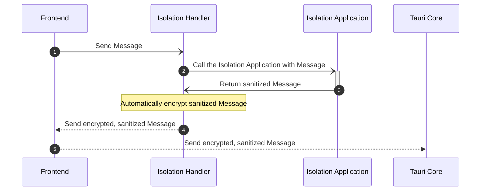

# Context Isolation

Context Isolation is a way to intercept and modify Tauri API messages
sent by the frontend before they get to Tauri Core, all with
JavaScript. The secure JavaScript code that is injected by the
Isolation pattern is referred to as the Isolation application.

This is useful to validate, sanitize, and filter messages sent from the
Frontend before they even enter the Core's secure context.

## Why?

The Isolation pattern's purpose is to provide a mechanism for
developers to help protect their application from unwanted or
malicious frontend calls to Tauri Core. The need for the Isolation
pattern rose out of threats coming from untrusted content running on
the Frontend, a common case for applications with many dependencies.
See [Security: Threat Models] for a list of many sources of threats
that an application may see.

The largest threat model described above that the Isolation pattern
was designed in mind with was Development Threats. Not only do many
Frontend build-time tools consist of many dozen (or hundreds) of often
deeply-nested dependencies, but a complex application may also have a
large amount of (also often deeply-nested) dependencies that are
bundled into the final output.

## When?

Tauri highly recommends using the isolation patten whenever it can be
used. Because the Isolation application intercepts _all_ messages from
the Frontend, it can _always_ be used.

We highly suggest that you lock down your application whenever you use
external Tauri APIs. As the developer, you can utilize the secure
Isolation application to verify IPC inputs are within some expected
parameters. For example, you may want to check that a call to read or
write a file is not trying to get to a path outside your
application's expected locations. <br> Another example is making
sure that a Tauri API HTTP fetch call is only setting the Origin
header to what your application expects it to be.

That said, it intercepts all messages from the Frontend, so it will
even work with always-on APIs such as [Events]. Since some events may
cause your rust code to perform actions, the same validation
techniques can be used.

## How?

An Isolation Application is essentially just a JavaScript file that
Tauri will run in a locked-down, isolated environment. You assign a
callback to the `window.__TAURI_ISOLATION_HOOK__` global property that
Tauri will invoke whenever an IPC message is about to be sent.

Because the point of the Isolation application is to protect against
Development Threats, we highly recommend keeping your Isolation
application as simple as possible. <br> Fewer dependencies and build
steps mean less risk of supply chain attacks against your Isolation
application.

### Creating the Isolation Application

We will make a small hello-world style Isolation application and hook
it up to an imaginary existing Tauri application. It will do no
verification of the messages passing through it, only print the
contents to the WebView console.

For the purposes of this example, let's imagine we are in the same
directory as `tauri.conf.json`. The existing Tauri application has
it's `distDir` set to `../dist`.

Filename: index.html

<figure>

```html
<!DOCTYPE html>
<html lang="en">
  <head>
    <meta charset="UTF-8" />
    <title>Isolation Secure Script</title>
  </head>
  <body>
    <script src="index.js"></script>
  </body>
</html>
```

<figcaption>Listing 1-1: HTML entrypoint responsible for loading the JavaScript.</figcaption>
</figure>

Filename: index.js

<figure>

```javascript
window.__TAURI_ISOLATION_HOOK__ = (payload) => {
  // let's just print payload
  console.log("hook", payload);
  return payload;
};
```

<figcaption>Listing 1-2: The main Isolation Application script.</figcaption>
</figure>

We need to set up our `tauri.conf.json` configuration to enable
Context Isolation.

### Configuration

Let's assume that our main frontend `distDir` is set to `../dist`. We
also output the previously created Isolation application to
`../dist-isolation`.

Filename: tauri.conf.json

```json
{
  "build": {
    "distDir": "../dist"
  },
  "tauri": {
    "pattern": {
      "use": "isolation",
      "options": {
        "dir": "../dist-isolation"
      }
    }
  }
}
```

## Digging Deeper

If you want to fully understand how the Context Isolation is
implemented, so you can properly secure your application, we go into
more detail below.

<figure>



<figcaption>Figure 1-4: Approximate Steps of an IPC Message being sent to Tauri Core with Context
Isolation enabled.</figcaption>
</figure>

1. When `invoke` is called, the Message gets sent to the Isolation
   Application.
2. Pass the message into the Isolation Application's hook. The Message
   object has been checked to follow the minimum correct shape.<!-- TODO: something about this one is weird, idk -->
3. The return value is used as the new Message. The Isolation
   Application _may_ have modified the Message to help sanitize input.
4. The sanitized Message is **automatically** encrypted using AES-GCM
   using a runtime-generated key and sent to the Frontend.
5. The encrypted, sanitized message is sent to Tauri Core; which
   exclusively processes encrypted messages while Context Isolation is
   enabled.

### Performance Implications

Because encryption of the message does occur, this does mean that
there are additional overhead costs even if the secure Isolation
application doesn't do anything. Most applications should not notice
the runtime costs of encrypting/decrypting the IPC messages as they
are both relatively small and AES-GCM is relatively fast. If you are
unfamiliar with AES-GCM, all that is relative in this context is that
it's the only authenticated mode algorithm included in [SubtleCrypto]
and that you probably already use it every day under the hood with
TLS.

There is also a cryptographically secure key generated once each time
the Tauri application is started. It is not generally noticeable if
the system already has enough entropy to immediately return enough
random numbers, which is extremely common for desktop environments. If
running in a headless environment to perform some [end-to-emd testing
with WebDriver] then you may want to install some sort of entropy
generating service such as [`haveged`] if your operating system does
not have one included.

> Linux 5.6 (March 2020) now includes entropy generation using
> speculative execution. <!-- TODO: Source? -->

### Limitations

There are a few limitations with Context Isolation due to platform
inconsistencies. The most significant limitation is due to external
files not loading correctly inside sandboxed `iframes` on Windows.
Because of this, we have implemented a simple script inlining step
during build time that takes the content of scripts relative to the
Isolation application and injects them inline. This means that typical
bundling or simple including of files like
`<script src="index.js"></script>` still works properly, but newer
mechanisms such as ES Modules will not successfully load.

[security: threat models]: security#threat-models
[subtlecrypto]:
  https://developer.mozilla.org/en-US/docs/Web/API/SubtleCrypto
[`haveged`]: https://www.issihosts.com/haveged/
[events]: ../inter-process-communication.md#events
