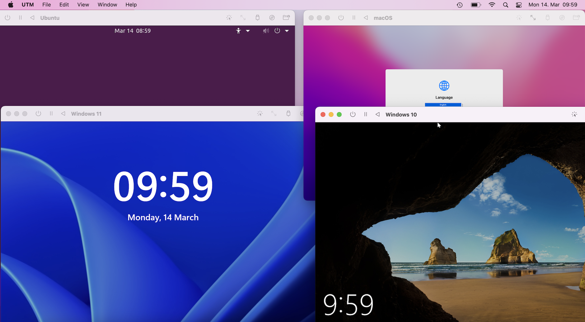

# Virtual Machines

Tauri allows you to create cross-platform applications from a single codebase with ease. 
This, however, doesn't mean you can just package a Website with Tauri and be good to go. Your end-users may run a number of Operating Systems (OS) on a wide variety of hardware. And they all expect your app to run well on their machine, "feel native" and integrate with OS features.

Here is where Virtual Machines (VMs) come into play: They can simulate a variety of CPU architectures, Peripherals and run any Operating System right from the convenience of your main development machine. This allows you to switch between different Operating Systems very quickly, to test and develop features and them.

The following picture shows a Windows 10, Windows 11, Ubuntu and macOS VM running inside a macOS host through [UTM] a VM software for macOS.

<figure>
  <picture>
    <source srcset="../img/vms.avif" type="image/avif">
    <source srcset="../img/vms.webp" type="image/webp">
    
  </picture>
<figcaption>Listing 2-TODO: Windows 10, Windows 11, Ubuntu and macOS VMs running inside a macOS host through [UTM] a VM software for macOS.</figcaption>
</figure>

## VM Software

There are many Virtual Machine Solutions available; most of them are free and Open-Source with some paid solutions.  
And since giving detailed guides for each would blow the scope of this document, we give you a shortlist of popular projects below and invite you to read their respective documentation for more details.

- [**VirtualBox**][VirtualBox]
  Popular open-source VM software developed by Oracle.
    
- [**VMware**][VMware]
  Paid VM software for Windows with a feature-limited free version.

- [**Hyper-V**][Hyper-V]
  Hardware virtualization technology built into Windows itself.

- [**QEMU**][QEMU]
  Open-source virtualization and emulation software predominantly on Linux and macOS.

- [**UTM**][UTM]
  Easy to use virtualization and emulation on macOS using Apple Silicon features to run at near native speeds. Uses QEMU under the hood.

[VirtualBox]: https://www.virtualbox.org
[VMware]: https://www.vmware.com
[Hyper-V]: https://docs.microsoft.com/en-us/virtualization/hyper-v-on-windows/about/
[QEMU]: https://www.qemu.org
[UTM]: https://mac.getutm.app
