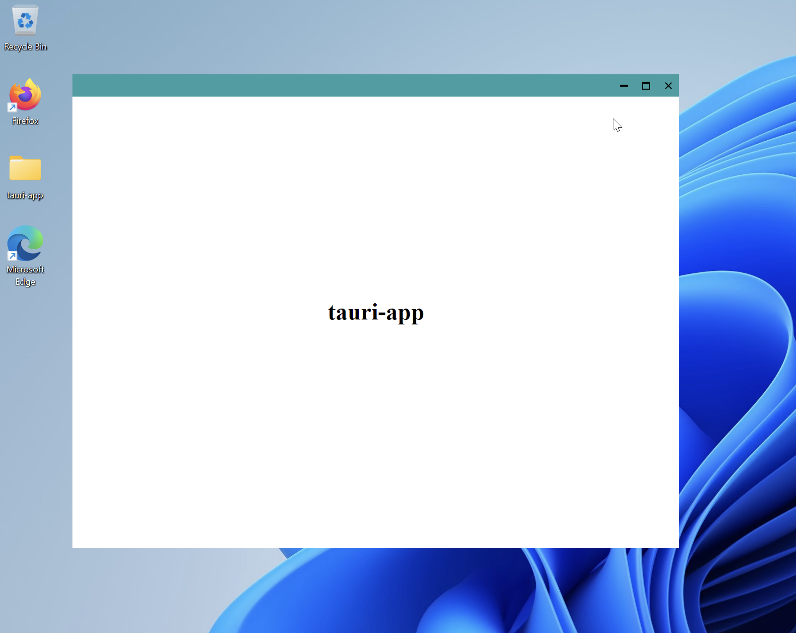

# Window Customization

Tauri provides lots of options for customizing the look and feel of
your app's window. You can create custom titlebars, have transparent
windows, enforce size constraints, and more. This guide contains a
number of quick examples for common cases.

## Creating a Custom Titlebar

<figure>
<picture>
  <source srcset="../img/custom_titlebar_light.avif" type="image/avif" media="(prefers-color-scheme:light)">
  <source srcset="../img/custom_titlebar_dark.avif" type="image/avif" media="(prefers-color-scheme:dark)">
  <source srcset="../img/custom_titlebar_light.webp" type="image/webp" media="(prefers-color-scheme:light)">
  <source srcset="../img/custom_titlebar_dark.webp" type="image/webp" media="(prefers-color-scheme:dark)">
  <source srcset="../img/custom_titlebar_light.png" type="image/png" media="(prefers-color-scheme:light)">
  <source srcset="../img/custom_titlebar_dark.png" type="image/png" media="(prefers-color-scheme:dark)">
   
</picture>
<figcaption></figcaption>
</figure>

To make the custom titlebar work, you need to disable decorations for
the window by setting [`tauri.windows.decorations`],
[`WebviewWindow.setDecorations`] or [`WindowBuilder::decorations`] to
false. Next, you need to add the HTML for the titlebar. Put this at
the top of your `<body>` tag. Notice the `data-tauri-drag-region` data
attribute, it allows you to drag the window around like a native
titlebar would.

```html
<div data-tauri-drag-region class="titlebar">
  <div class="titlebar-button" id="titlebar-minimize">
    
  </div>
  <div class="titlebar-button" id="titlebar-maximize">
    
  </div>
  <div class="titlebar-button" id="titlebar-close">
    
  </div>
</div>
```

Now you need to add some CSS for the titlebar to keep it at the top of
the screen and style the buttons. Note that you may need to move the
rest of your content down so that the titlebar doesn't cover it.

```css
.titlebar {
  height: 30px;
  background: #329ea3;
  user-select: none;
  display: flex;
  justify-content: flex-end;
  position: fixed;
  top: 0;
  left: 0;
  right: 0;
}
.titlebar-button {
  display: inline-flex;
  justify-content: center;
  align-items: center;
  width: 30px;
  height: 30px;
}
.titlebar-button:hover {
  background: #5bbec3;
}
```

Finally, you need some JavaScript to make the buttons work:

```javascript
import { appWindow } from "@tauri-apps/api/window";
document
  .getElementById("titlebar-minimize")
  .addEventListener("click", () => appWindow.minimize());
document
  .getElementById("titlebar-maximize")
  .addEventListener("click", () => appWindow.toggleMaximize());
document
  .getElementById("titlebar-close")
  .addEventListener("click", () => appWindow.close());
```

[`tauri.windows.decorations`]:
  https://tauri.studio/docs/api/config/#tauri.windows.decorations
[`webviewwindow.setdecorations`]:
  https://tauri.studio/docs/api/js/classes/window.WebviewWindow#setdecorations
[`windowbuilder::decorations`]:
  https://docs.rs/tauri/1.0.0-rc.4/tauri/window/struct.WindowBuilder.html#method.decorations
