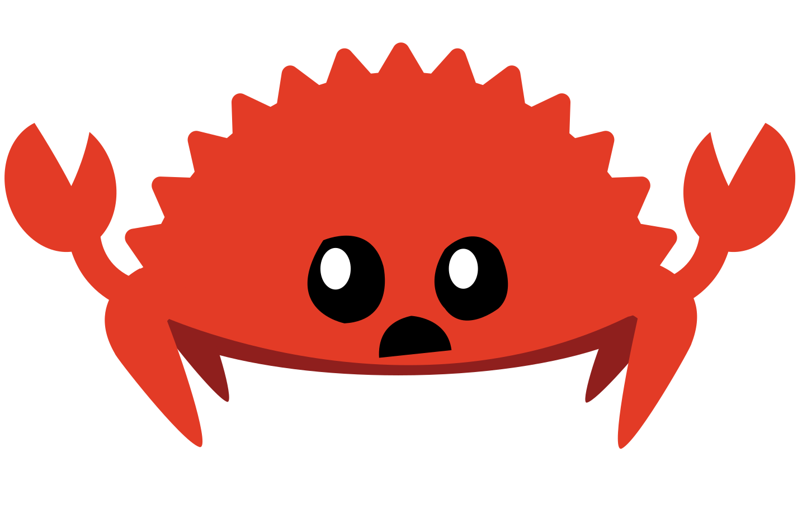

# The Tauri Documentation WIP

<picture>
    <source srcset="img/banner.avif" type="image/avif">
    <source srcset="img/banner.webp" type="image/webp">
    
</picture>

> This is my **work-in-progress** version of the new tauri
> documentation. Beware of typos, inaccuracies, mistakes and missing
> pages!

Tauri is a toolkit that helps developers make applications for the
major desktop platforms - using virtually any frontend framework in
existence. The core is built with Rust, and the CLI leverages Node.js
making Tauri a genuinely polyglot approach to creating and maintaining
great apps.

<!-- TODO: Why Tauri? -->

Once in a while, we will show you code examples that do not work or do
not compile. In most situations, we lead you to correct solution and
the Rust mascot Ferris will always draw your attention to code that
isn't meant to work:

| Ferris                                                                                                           | Meaning                                          |
| ---------------------------------------------------------------------------------------------------------------- | ------------------------------------------------ |
|                 | This code does not compile!                      |
|              | This code panics!                                |
|  | This code does not produce the desired behavior. |
